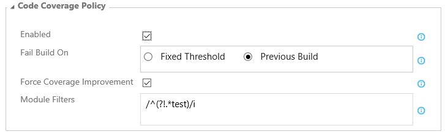

[Zurück zur Übersicht](./overview.md)

# Code-Coverage-Regel
Die meisten Teams, die Unit Testing einsetzen, lassen während der Testausführung die Code Coverage berechnen. Obwohl man die Code
Coverage niemals als einzige Metrik für die Test-/Code-Qualität heranziehen sollte, ist sie ein einfach nutzbarer Indikator, der
anzeigt, ob das Team bei der Entwicklung stets auch an automatisches Testen denkt.

Die *Code-Coverage-Regel* ermöglicht es, den Build zu brechen, wenn die Code Coverage unter einen bestimmten Wert fällt oder sich
von einem Build zum nächsten verschlechtert.

### Limitierungen und Spezialfälle
- **Verwenden der Test-Impact-Analyse (TIA)**  
  Wir haben vor kurzem die [Test-Impact-Analyse][TIA] vorgestellt, mit der sich kontinuierliches Testen beschleunigen lässt. Obwohl
  es technisch möglich ist, die *Code-Coverage-Regel* in Verbindung mit TIA einzusetzen, raten wir davon ab. TIA erkennt automatisch
  anhand von Code-Änderungen, welche Tests relevant sind und führt nur diese aus. Aus diesem Grund können die Code-Coverage-Werte
  von einem Build zum anderen sehr stark schwanken, so dass die Regel nicht sinnvoll angewendet werden kann.

- **Code Coverage und Multi-Konfigurations-Builds**  
  Multi-Konfigurations-Builds starten mehrere Build-Jobs (basierend auf der *Multipliers*-Option) aus einem Build heraus. Dies
  wird meistens dazu genutzt, Kombinationen verschiedener Konfigurationen (z.B. Debug, Release) und Plattformen (z.B. x86, x64)
  parallel zu bauen, kann aber mit jeder beliebigen Kombination von Build-Variablen verwendet werden. Wenn Sie Code Coverage innerhalb
  eines Multi-Konfigurations-Builds ermitteln, beachten Sie bitte folgendes Verhalten des Build-Systems:

  - **Visual Studio Test**  
    Wenn Sie mehrere VSTest-Tasks mit aktivierter Code Coverage verwenden, werden die Code-Coverage-Werte zu einem einzigen Wert
    zusammengefasst, sofern die Tests nicht für ungerschiedliche Konfigurationen (d.h. Debug/Release) und/oder Plattformen (d.h.
    any cpu/x86/x64) ausgeführt werden. Die Ausführung mehrere Build-Jobs mit derselben Konfiguration/Plattform innerhalb eines Builds
    führt zu einem undefinierten Ergebnis der Regel, abhängig von der Konfiguration und Geschwindigkeit Ihres Builds.
  - **Testwerkzeuge von Drittherstellern**  
    Wenn Sie mehrere Testwerkzeuge von Drittherstellern mit aktivierter Code Coverage verwenden (z.B. Maven mit JaCoCo), überschreibt
    jeder Testlauf die zuvor im Build hinterlegten Code-Coverage-Werte. Multi-Konfigurations-Builds mit Testwerkzeugen von Drittherstellern
    führen daher sehr wahrscheinlich zu unerwarteten Code-Coverage-Werten und ebenso unerwarteten Ergebnissen der Regel.

[TIA]: https://blogs.msdn.microsoft.com/visualstudioalm/2017/03/02/accelerated-continuous-testing-with-test-impact-analysis-part-1/

### Parameter der Code-Coverage-Regel

- **Aktiv:** Über diese Option lässt sich die Regel ein- und ausschalten. Wenn die Regel ausgeschaltet ist, sind die weiteren
  Parameter nicht sichtbar.

- **Abbruchkriterium:** Setzen Sie diese Option auf `Fester Schwellwert`, um den Build abzubrechen, wenn ein bestimmter Code-Coverage-Wert
  unterschritten wird. Dies ist dann hilfreich, wenn Sie einen gewissen Spielraum bei der Code Coverage zulassen wollen, gleichzeitig aber
  sicherstellen möchten, dass ein Minimum an Code Coverage nie unterschritten wird. Wenn Sie die Option `Vorheriger Wert` wählen, wird der
  Build abgebrochen, wenn der Code-Coverage-Wert unter den des letzten Builds fällt.

- **Coverage-Typ:** Wählen Sie den Coverage-Typ aus, mit dem die Code-Coverage-Regel arbeiten soll. Die meisten Code-Coverage-Werkzeuge
  ermitteln die Code Coverage basierend auf verschiedenen Code-Elementen. Der *Visual Studio Test* Task ermittelt z.B. sowohl die Anzahl
  der Code-Zeilen (Line Coverage) als auch die Anzahl der Code-Blöcke (Block Coverage), die von Tests durchlaufen wurden. Andere Werkzeuge
  wie *Cobertura* berechnen andere Coverage-Typen wie z.B. die Anzahl der durchlaufenen Verzweigungen (Branch Coverage), die der Block
  Coverage ähnelt. Wir empfehlen die Nutzung von `Block Coverage` in Verbindung mit dem *Visual Studio Test* task oder `Branch Coverage`
  für Werkzeuge, die diesen Coverage-Typ unterstützen, da diese beiden Typen genauer arbeiten als andere. Wenn Block und Branch Coverage
  nicht zur Verfügung stehen, nutzen Sie `Line Coverage`. Für Drittherstellerwerkzeuge wie *JaCoCo*, die weitere Coverage-Typen unterstützen,
  wählen Sie `Custom Coverage` und geben Sie den Namen des zu verwendenden Coverage-Typs an (siehe unten).

- **Coverage-Typ-Name:** Geben Sie den Namen des zu verwendenden Coverage-Typs an. Wenn Sie unsicher sind, wie genau der Name lautet,
  schauen Sie in den Code-Coverage-Bereich der Build-Zusammenfassung. Der *Coverage-Typ-Name* muss einem Wert entsprechen, der in diesem
  Bereich aufgeführt ist. Dieser Parameter ist nur sichtbar, wenn als *Coverage-Typ* die Option `Custom Coverage` gewählt wurde.

- **Schwellwert:** Geben sie den minimalen Code-Coverage-Wert in Prozent an. Dieser Parameter ist nur sichtbar, wenn als
  *Abbruchkriterium* die Option `Fester Schwellwert` gewählt wurde.

- **Verbesserung erzwingen:** Aktivieren Sie diese Option, wenn der aktuelle Build immer eine höhere Code Coverage als der vorherige
  Build haben soll. Diese Option ist nur sichtbar, wenn als *Abbruchkriterium* die Option `Vorheriger Wert` gewählt wurde.

- **Obergrenze:** Legen Sie eine Obergrenze für die Code-Coverage-Verbesserung fest. Grundsätzlich ist es nicht empfehlenswert zu
  versuchen, eine Code Coverage von 100% zu erreichen, da es dazu notwendig wäre, auch sämtlichen Trivial-Code (z.B. Getter/Setter) zu
  testen. Setzen Sie diesen Parameter auf einen sinnvollen Wert (z.B. 70%-80%). Der Build wird dann fehlschlagen, solange der Code-Coverage-Wert
  unterhalb dieses Wertes liegt. Sobald der Wert erreicht oder überschritten wird, wird der Build nicht mehr gebrochen. Dieser Parameter
  ist nur sichtbar, wenn die Option *Verbesserung erzwingen* aktiviert ist.

- **Delta Type:** Setzen Sie diese Option auf `Prozentwert`, wenn der prozentuale Code-Coverage-Wert beim Vergleich zwischen dem aktuellen
  und dem vorherigen Build genutzt werden soll. Wenn Sie die Option `Absoluter Wert` wählen, wird die absolute Anzahl der durchlaufenen Code-Blöcke
  zum Vergleich herangezogen.

- **Modul-Filter (_deprecated_):** Standardmäßig bewertet die Regel die aggregierte Code Coverage aller Module, für die während des Testlaufs eine
  Code Coverage berechnet wurde. *Modul-Filter* enthält eine Liste von regulären Ausdrücken (einer pro Zeile). Die Regel berücksichtigt
  nur Module, auf deren Name einer der Filter passt. Wenn Sie alle Module aus der Berechnung ausschließen möchten, die das Wort *test* beinhalten,
  können Sie den Wert `/^(?!.*test)/i` verwenden.
  
  **Hinweis:** Dieser Parameter funktioniert nur bei Code Coverage, die mit dem *Visual Studio Test* Task ermittelt wurde.

  **Hinweis:** Reguläre Ausdrücke müssen in der JavaScript RegExp-Syntax angegeben werden. Klicken Sie [hier][JSRegExp], um mehr über reguläre
  Ausdrücke zu erfahren.

  Wenn Sie *Modul-Filter* verwenden, weichen die Code-Coverage-Werte, die im Code-Coverage-Bereich der Build-Zusammenfassung angezeigt
  werden, ggf. von denen ab, die die Code-Coverage-Regel anzeigt. Dies kann sehr verwirrend sein. Aus diesem Grund wurde der Parameter
  als deprecated markiert und wird mit der nächsten Major-Version vollständig entfernt. Der empfohlene Weg, die Berechnung der Code Coverage
  auf Teile Ihres Codes zu beschränken, ist der Einsatz von Run Settings für den *Visual Studio Test* Task (siehe
  [Anpassen der Codeabdeckungsanalyse][RunSettings]) oder vergleichbaren Einstellungen für andere Test- und Code-Coverage-Werkzeuge.

[JSRegExp]: http://www.regular-expressions.info/javascript.html
[RunSettings]: https://msdn.microsoft.com/de-de/library/jj159530.aspx

- **Konfiguration:** Geben Sie die Konfiguration an, für die die Code Coverage geprüft werden soll. In den meisten Fällen kompiliert und testet
  ein Build nur eine Konfiguration (z.B. Debug), die über die Variable `$(BuildConfiguration)` definiert wird. Daher passt der Default-Wert für
  die meisten Builds, besonders für Multi-Konfiugrations-Builds, die *BuildConfiguration* als Multiplikator nutzen. Wenn Sie in einem Build-Job
  mehrere Konfiugrationen kompilieren und testen, geben Sie hier entweder einen spezifischen Wert an oder geben Sie keinen Wert an, um die
  aggregierte Code Coverage aller Konfigurationen zu prüfen.

- **Plattform:** Geben Sie die Plattform an, für die die Code Coverage geprüft werden soll. In den meisten Fällen kompiliert und testet
  ein Build nur eine Plattform (z.B. any cpu), die über die Variable `$(BuildPlatform)` definiert wird. Daher passt der Default-Wert für
  die meisten Builds, besonders für Multi-Konfiugrations-Builds, die *BuildPlatform* als Multiplikator nutzen. Wenn Sie in einem Build-Job
  mehrere Plattformen kompilieren und testen, geben Sie hier entweder einen spezifischen Wert an oder geben Sie keinen Wert an, um die
  aggregierte Code Coverage aller Plattformen zu prüfen.
