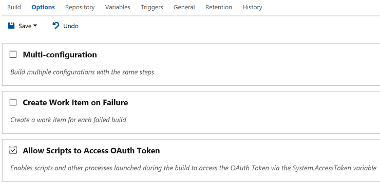
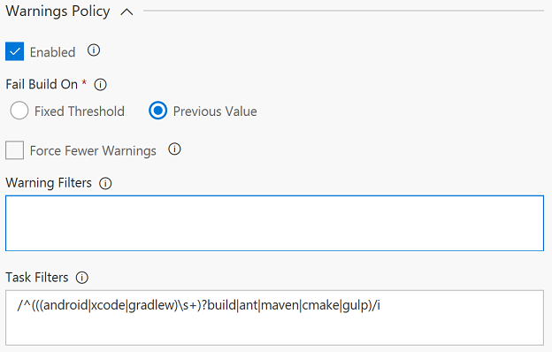

# Build Quality Checks
Der *Build Quality Checks* Task ermöglicht Ihnen, Qualitätsprüfungen in den Buil-Prozess einzufügen.

### Hinzufügen des Tasks zu einer Build-Definition
Der *Build Quality Checks* Task muss nach den Tasks eingefügt werden, die von ihm überwacht werden sollen. In einer Visual Studio
Build-Definition bietet es sich z.B. an, den Task hinter den Build-, Test- und Symbol-Indexing/Publishing-Tasks einzufügen.
Dadurch wird sichergestellt, dass die Testergebnisse und die Kompilate/Symbole auch dann zur Verfügung stehen, wenn der Build
durch eine der Regeln abgebrochen wird. 

**Hinweis:** Der Task muss auf Team Foundation Server/Visual Studio Team Services zugreifen, um Build-Informationen zu lesen. Sie
müssen daher den Zugriff auf das OAuth-Token des Builds zulassen:

## Warnungen-Regel
Viele Software-Projekte, vor allem ältere, die über eine längere Zeit gewachsen sind, häufen hunderte oder tausende Build-
Warnungen an. Diese Warnungen durch Refactoring oder aufräumen des Codes loszuwerden, ist oft schwierig, da neue Warnungen
in den bestehenden untergehen. In diesem Fall ist es auch nicht hilfreich, Warnungen grundsätzlich wie Fehler zu behandeln
(*treat warnings as errors*), denn dies zwingt Teams entweder dazu, die Warnings sofort zu eliminieren oder über einen langen
Zeitraum mit fehlschlagenden Builds zu leben. 

Die *Build Warnings Policy* hilft, den Überblick über Warnungen zu behalten und sie über die Zeit zu reduzieren. Dies wird
erreicht, indem der Build gebrochen wird, wenn die Zahl der Warnungen einen bestimmten Wert übersteigt oder sich von einem
Build zum nächsten erhöht.

### Parameter der Warnungen-Regel

- **Aktiv:** Über diese Option lässt sich die Regel ein- und ausschalten. Wenn die Regel ausgeschaltet ist, sind die weiteren
Parameter nicht sichtbar.

- **Abbruchkriterium:** Setzen Sie diese Option auf `Fester Schwellwert`, um den Build abzubrechen, wenn eine bestimmte Zahl an
Warnungen überschritten wird. Dies ist dann hilfreich, wenn Sie eine geringe Zahl an Warnungen zulassen aber gleichzeitig
sicherstellen möchten, dass die Warnungen nicht Überhand nehmen. Um die Zahl der Warnungen über einen längeren Zeitraum
kontinuierlich zu reduzieren, wählen Sie die Option `Vorheriger Wert`. Dadurch wird der Build abgebrochen, wenn die Zahl der
Warnungen seit dem vorherigen Build gestiegen ist.

- **Schwellwert:** Geben sie die maximale Anzahl an Warnungen an, die nicht überschritten werden darf. Dieser Parameter ist
nur sichtbar, wenn als *Abbruchkriterium* die Option `Fester Schwellwert` gewählt wurde.

- **Weniger Warnungen erzwingen:** Aktivieren Sie diese Option, wenn der aktuelle Build immer weniger Warnungen als der vorherige
Build haben soll. Diese Option ist nur sichtbar, wenn als *Abbruchkriterium* die Option `Vorheriger Wert` gewählt wurde.

- **Task-Filter:** Da das Build-System verschiedenste Tasks ausführen und jeder dieser Tasks Warnungen erzeugen kann, muss die
*Warnungen-Regel* wissen, welche Tasks berücksichtigt und welche ignoriert werden sollen. *Task-Filter* enthält eine Liste
von regulären Ausdrücken (einer pro Zeile). Die Regel berücksichtigt nur Tasks, auf die einer der Filter passt. Die Filter werden
auf den Namen der Timeline eines Tasks angewendet; dieser wird in der Build-Definition unterhalb des Task-Namens angezeigt. Der
Standardwert `/^(((android|xcode|gradlew)\\s+)?build|ant|maven|cmake|gulp)/i` berücksichtig bereits die meisten der Standard-Build-Tasks
in Team Foundation Server/Visual Studio Team Services. **Hinweis:** Reguläre Ausdrücke müssen in der JavaScript RegExp-Syntax angegeben
werden. Klicken Sie [hier](http://www.regular-expressions.info/javascript.html), um mehr über reguläre Ausdrücke zu erfahren.

## Code-Coverage-Regel
Die meisten Teams, die Unit Testing einsetzen, lassen während der Testausführung die Code Coverage berechnen. Obwohl man die Code
Coverage niemals als einzige Metrik für die Test-/Code-Qualität heranziehen sollte, ist sie ein einfach nutzbarer Indikator, der
anzeigt, ob das Team bei der Entwicklung stets auch an automatisches Testen denkt.

Die *Code-Coverage-Regel* ermöglicht es, den Build zu brechen, wenn die Code Coverage unter einen bestimmten Wert fällt oder sich
von einem Build zum nächsten verschlechtert.

### Parameter der Code-Coverage-Regel

- **Aktiv:** Über diese Option lässt sich die Regel ein- und ausschalten. Wenn die Regel ausgeschaltet ist, sind die weiteren
Parameter nicht sichtbar.

- **Abbruchkriterium:** Setzen Sie diese Option auf `Fester Schwellwert`, um den Build abzubrechen, wenn ein bestimmter Code-Coverage-Wert
unterschritten wird. Dies ist dann hilfreich, wenn Sie einen gewissen Spielraum bei der Code Coverage zulassen wollen, gleichzeitig aber
sicherstellen möchten, dass ein Minimum an Code Coverage nie unterschritten wird. Wenn Sie die Option `Vorheriger Wert` wählen, wird der
Build abgebrochen, wenn der Code-Coverage-Wert unter den des letzten Builds fällt.

- **Schwellwert:** Geben sie den minimalen Code-Coverage-Wert in Prozent an. Dieser Parameter ist nur sichtbar, wenn als
*Abbruchkriterium* die Option `Fester Schwellwert` gewählt wurde.

- **Verbesserung erzwingen:** Aktivieren Sie diese Option, wenn der aktuelle Build immer eine höhere Code Coverage als der vorherige
Build haben soll. Diese Option ist nur sichtbar, wenn als *Abbruchkriterium* die Option `Vorheriger Wert` gewählt wurde.

- **Obergrenze:** Legen Sie eine Obergrenze für die Code-Coverage-Verbesserung fest. Grundsätzlich ist es nicht empfehlenswert zu
versuchen, eine Code Coverage von 100% zu erreichen, da es dazu notwendig wäre, auch sämtlichen Trivial-Code (z.B. Getter/Setter) zu
testen. Setzen Sie diesen Parameter auf einen sinnvollen Wert (z.B. 70%-80%). Der Build wird dann fehlschlagen, solange der Code-Coverage-Wert
unterhalb dieses Wertes liegt. Sobald der Wert erreicht oder überschritten wird, wird der Build nicht mehr gebrochen. Dieser Parameters
ist nur sichtbar, wenn die Option *Verbesserung erzwingen* aktiviert ist.

- **Delta Type:** Setzen Sie diese Option auf `Prozentwert`, wenn der prozentuale Code-Coverage-Wert beim Vergleich zwischen dem aktuellen
und dem vorherigen Build genutzt werden soll. Wenn Sie die Option `Absoluter Wert` wählen, wird die absolute Zahl der durchlaufenen Code-Blöcke
zum Vergleich herangezogen.

- **Modul-Filter:** Standardmäßig bewertet die Regel die aggregierte Code Coverage aller Module, für die während des Testlaufs eine
Code Coverage berechnet wurde. *Modul-Filter* enthält eine Liste von regulären Ausdrücken (einer pro Zeile). Die Regel berücksichtigt
nur Module, auf deren Name einer der Filter passt. Der Standardwert `/^(?!.*test)/i` berücksichtig bereits die meisten der
Standard-Build-Tasks in TFS/VSTS. **Hinweis:** Reguläre Ausdrücke müssen in der JavaScript RegExp-Syntax angegeben werden. Klicken Sie
[hier](http://www.regular-expressions.info/javascript.html), um mehr über reguläre Ausdrücke zu erfahren.

[Checklist board icon](https://www.vexels.com/vectors/png-svg/129767/checklist-board-icon) | Icon designed by Vexels.com
