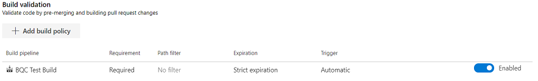
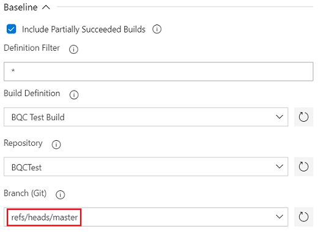
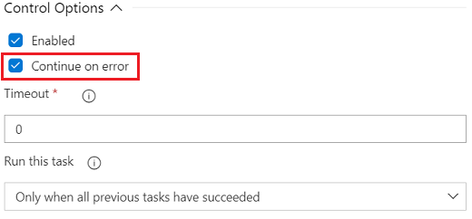
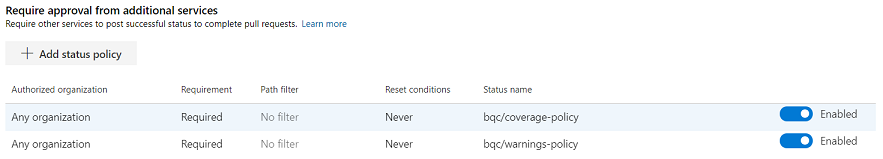
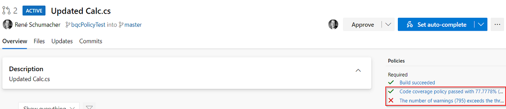

[Back to Overview](./overview.md) | [Pull Request Policy](./pull-request-policy) | [TFVC Feature Branches](./tfvc-feature-branches)

# Pull Requests and TFVC Feature Branches
One of the most common uses for the *Build Quality Checks* task is to validate code quality metrics for new code before it is integrated back into the main code branch. For Git repositories this usually means running the task as part of a pull request workflow. While Team Foundation Version Control (TFVC) does not support pull requests, you can still use the task to ensure code quality on a feature branch does not fall below that of the main branch.

## Pull Request Policy
A good and widely used practice when working with Git repositories is to develop new code on a short-lived and frequently updated *topic branch* that is merged back to *master* through a pull request workflow. This workflow allows manual inspection of and discussion about the new code changes by other developers which not only increases the overall quality, readability, and maintainability of the code, but also is a great way to share knowledge about the system under development. In addition to this manual quality assurance, pull requests also support running automated quality gates that can prevent completion of a pull request unless specific quality levels are met. Those gates usually take the form of validation build and/or status policies (e.g., checks done by external services).

In order to prevent people from introducing code changes without addition quality assurance, Azure DevOps allows protecting specific Git branches with a [branch policy](https://docs.microsoft.com/en-us/azure/devops/repos/git/branch-policies-overview?view=azure-devops). This essentially prohibits direct pushes to the protected branches and forces developers to follow the pull request workflow. You can use the *Build Quality Checks* task as part of such a branch policy in two different ways: as a simple *build validation* or as a *pull request status policy*. The following sections describe both ways in more detail.

### Build Validation
Running a validation build as part of a branch policy is the simplest form of automated quality gate you can add. It prevents a pull request from being completed unless all associated validation builds were at least partially succeeded. It is often a good idea to use the same pipeline for regular builds (e.g., continuous integration) on *master* as well as for pull request validation. This ensures that the same quality gates are in place for all code, no matter how it was introduced.

If you don't want to run some of the build steps (e.g., publishing of build artifacts) during pull request validation, you can use [task conditions](https://docs.microsoft.com/en-us/azure/devops/pipelines/process/conditions?view=azure-devops&tabs=yaml) to only run those steps when needed. Since it is harder to understand what a pipeline does the more conditions you add, though, it is better to use mulitple pipeline definitons whenever there are lots of differences between a regular build and a pull request validation build.

#### Prerequisites
In order to use the *Build Quality Checks* task as a pull request quality gate, simply create a pipeline definition that contains the taks and configure this pipeline as a *build validation* pipeline in the branch policy:

For more information about build validation configuration see the [official documentation](https://docs.microsoft.com/en-us/azure/devops/repos/git/branch-policies?view=azure-devops#build-validation).

#### Configuring *Build Quality Checks*
Configure the policies you want to run as usual and make sure that you do not check the *Continue on error* option of the task so that the build fails if one of the policies fails. In most cases you should set the policies to fail based on the previous build's value (see *Fail Build On* setting). This ensures that new code changes that result in lesser quality cannot be merged back into the pull request's target branch (e.g., *master*).

In addition to setting the *Fail Build On* parameter to `Previous Build` you may also want to configure a baseline. Without any special baseline configuration the task first tries to compare policy values with those of a previous build that ran for the same branch. If it cannot find such a build (i.e., you are running the first build for you pull request), it automatically looks for the previous build that ran for the pull request target branch. Thus, the first build for you pull request compares policy values with those from the pull request target branch while all subsequent builds compare with the values from your pull request branch. This default behavior should be suitable for most situations.

If you would like to always base policy evaluation on the pull request target or any other branch, you can set the baseline branch to a specific branch reference (e.g., *master*):

**Note:** When you use the same pipeline definition for multiple pull request scenarios and always compare to the pull request target branch, you can set the baseline branch to the variable **$(System.PullRequest.TargetBranch)**. For pull request builds this ensures that policy values are compared with values from the correct target branch. For other build types (e.g., CI builds) the task falls back to the default behavior because the variable is not defined.

### Status Policy
In some cases you may not want to always break your build whenever one of the *Build Quality Checks* policies fails. A good example is when you're using the same pipeline defition for a nightly build and pull request validations. Let's assume the nightly build should always be successful even if there are known quality issues (e.g., due to a quick fix for an urgent production issue), but you still want to prevent people from merging new code unless all quality checks succeed.

Using *Build Quality Checks* as status policies can help in this case.

#### Prerequisites
Since the *Build Quality Checks* task always runs as part of a build pipeline, you need to set up a build validation pipelines as described above. In this case, however, you should check the *Continue on error* option of the task to ensure that the build succeeds even if one of the policies fails. In this case, the build will be marked as partially succeeded instead of failed.

**In addition you must ensure that your build account has the *Contribute to pull requests* permission so it can publish pull request statuses!** See [Git repository permissions](https://docs.microsoft.com/en-us/azure/devops/organizations/security/permissions?view=azure-devops&tabs=preview-page#git-repository-object-level) for more information. Depending on your *build job authorization scope* you need to either give that permission to your project build account (e.g., *YourProject Build Service (YourOrganization)*) or your project collection build account (e.g., *Project Collection Build Service (YourOrganization)*).

#### Configuring Status Policies
Once you have the validation build configured, you need to add all status policies that should prevent pull request completion. Unlike with the simple build validation described above, you can run multiple *Build Quality Checks* policies (e.g., enabled warnings and code coverage policies) but only check one of them in your pull request (e.g., only block pull requests based on code coverage).

Every policy publishes its own pull request status (see policy documentation) that can be used in the branch policy:

Since policy statuses are only published when the *Build Quality Checks* task runs, it is not recommended configuring the status reset. Configure proper validation build expiration instead as this will automatically refresh the policy statuses as well. For more information about status policy configuration see the [official documentation](https://docs.microsoft.com/en-us/azure/devops/repos/git/pr-status-policy?view=azure-devops).

### Branch Policy Results
Depending on your branch policy configuration you will see the different results posted to your pull request summary page as shown in the screenshot below:

## TFVC Feature Branches
*Coming soon*
