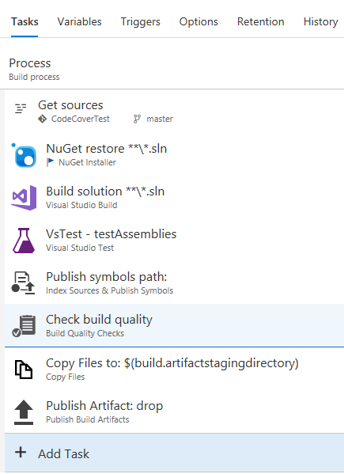
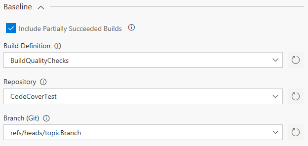
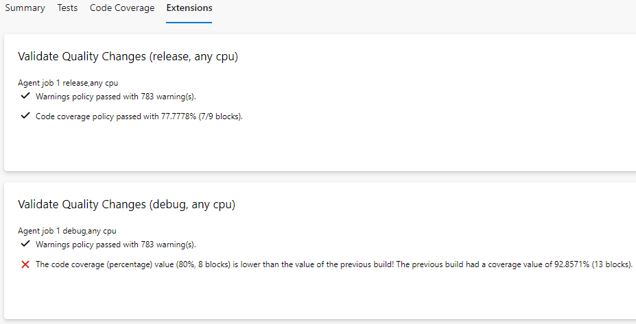

[Known Issues](#known-issues) | [Support](#support) | [Policies](#policies) | [Task Parameters](#task-parameters) | [Common Usage Scenarios](#common-usage-scenarios) | [Policy Results](#policy-results) | [FAQ](#faq)

# Build Quality Checks
The *Build Quality Checks* task allows you to add quality gates to your build process.

### Change Notes
You can find the changes notes for this task [here](https://github.com/MicrosoftPremier/VstsExtensions/blob/master/BuildQualityChecks/en-US/changeNotes.md).

### Known Issues
- We are phasing out Team Foundation Server 2015. If you're still using Team Foundation Server 2015, please stay on version 3.x of the
  extension. For newer versions of Team Foundation Server or Visual Studio Team Services please use version 4.x and higher.
- If you run your build agent behind a proxy server, the task will fail and you will see `connect ETIMEDOUT` somewhere in the
  task log, even if you configured the agent correctly as described [here](https://github.com/Microsoft/vsts-agent/blob/master/docs/start/proxyconfig.md).
  To fix this issue, create two environment variables called `HTTP_PROXY` and `HTTPS_PROXY` (either in system scope or the user scope of
  your agent service account) and set their value to your proxy server address including the port (e.g., http://myproxy:8080).  
  **Note:** Build tasks currently do not support proxy authentication.

### Support
If you need help with the extension or run into issues, please contact us at <a href='&#109;&#97;&#105;&#108;&#116;&#111;&#58;&#112;&#115;&#103;&#101;&#114;&#101;&#120;&#116;&#115;&#117;&#112;&#112;&#111;&#114;&#116;&#64;&#109;&#105;&#99;&#114;&#111;&#115;&#111;&#102;&#116;&#46;&#99;&#111;&#109;'>&#112;&#115;&#103;&#101;&#114;&#101;&#120;&#116;&#115;&#117;&#112;&#112;&#111;&#114;&#116;&#64;&#109;&#105;&#99;&#114;&#111;&#115;&#111;&#102;&#116;&#46;&#99;&#111;&#109;</a> or create an issue [here](https://github.com/MicrosoftPremier/VstsExtensions/issues).

### Adding the Task to a Build Definition
The *Build Quality Checks* (in task category *Build*) task needs to be placed after the tasks it should inspect. In a Visual Studio
build definition, e.g., an appropriate place would be after build, test, and symbol indexing/publishing. This ensures that, even if
the policy breaks the build, you still get test results as well as the compile output and symbols.

### Policies
The *Build Quality Checks* task currently supports two policies (click the link for details):

- **[Warnings Policy](https://github.com/MicrosoftPremier/VstsExtensions/blob/master/BuildQualityChecks/en-US/WarningsPolicy.md)** - Allows
  you to fail builds based on the number of build warnings.
- **[Code Coverage Policy](https://github.com/MicrosoftPremier/VstsExtensions/blob/master/BuildQualityChecks/en-US/CodeCoveragePolicy.md)** -
  Allows you to fail builds based on the code coverage value of your tests.

### Task Parameters

#### Baseline
If you choose `Previous Value` for the *Fail Build On* option for one of the policies, the policy value (e.g., number of warnings)
is, by default, compared to the corresponding value from the last build that ran for the current build definition. If the build
definition targets a Git repository hosted in Visual Studio Team Services or Team Foundation Server, the policy will look for the
last build that ran against the same branch as the current build. This behavior can be customized with the following parameters:

- <a name="partial">**Include Partially Succeeded Builds:**</a> Uncheck this option if policy values should only be compared to successful baseline builds.
  In most cases, including partially succeeded builds is the best option, so you can use the default setting.

- <a name="baseDefFilter">**Definition Filter**</a> If you have lots of build definitions, it can get hard to find the right one in the *Build Definition*
  drop-down list. You can use the *Definition Filter* to limit the number of definitions shown in the list. Either enter a specific definition name or
  use the asterisk (\*) wildcard to search for definitions starting with (e.g., Def\*), ending with (e.g., \*def), or containing (e.g., \*def\*) a specific
  value. If you want to list all build definitions in your project, use the default value "\*".

- <a name="baseDef">**Build Definition:**</a> Select the build definition that should be used to search for the baseline build. If you do not set a value,
  the last build of the current build definition will be used when comparing policy values. If the drop-down list is empty, please
  click the refresh icon to reload the list of available build definitions. The drop-down list shows a maximum of 1000 build definitions. If your definition
  is not visible, please enter the build definition ID manually. See
  [TFVC Topic Branches](https://github.com/MicrosoftPremier/VstsExtensions/blob/master/BuildQualityChecks/en-US/PullRequests.md#tfvc-topic-branches)
  for examples for when using a different build definition might be useful.

  **Note:** To always compare policy values to builds from the current build definition that target a specific branch, you need to
  choose the current build definition here and then select the appropriate values for *Repository* and *Branch (Git)*.

- <a name="baseRepo">**Repository:**</a> Select the repository that is used to search for baseline branches. The drop-down list is populated after you chose
  the *Build Definition* and will always contain the repository that the selected build definition is connected to. If the drop-down
  list is empty after selecting the *Build Definition*, please click the refresh icon to reload the repository information.

  **Note:** When you change the *Build Definition* after selecting a repository, you might see a GUID value in the repository parameter.
  This is a refresh limitation of the build UI. Please select the repository again to correct this.

- <a name="baseBranch">**Branch (Git):**</a> Select the branch that should be used to search for the baseline build. If you do note set a value, the last build
  targeting the currently built branch will be used when comparing policy values. If the drop-down list is empty after selecting the
  *Repository*, please click the refresh icon to reload the list of available branches. Branches are shown with their Git ref name, e.g.
  refs/heads/master or refs/heads/myTopicBranch. See
  [Pull Request Policy Builds](https://github.com/MicrosoftPremier/VstsExtensions/blob/master/BuildQualityChecks/en-US/PullRequests.md#pull-request-policy-builds)
  for examples for when using a different branch might be useful.

  **Note:** When you change the *Build Definition* and *Repository* after selecting a branch, you need to select the branch again.
  Otherwise, a wrong branch name may be saved to the task configuration. This is a refresh limitation of the build UI.

  **Note:** Whenever you choose a different baseline branch, make sure that the [retention policy](https://www.visualstudio.com/en-us/docs/build/concepts/policies/retention)
  is configured to keep at least one successful build for your baseline branch! 

#### Reporting Options
If you are using multiple *Build Quality Checks* tasks within the same build, you may use the **Run Title** parameter to specify a title that
is associated with a specific instance of the task. This will help distinguishing between the task results in the summary section. The run
title is added to the subsection header in the summary in the format \<Build Job Name\> - \<Run Title\>.

#### Advanced
- <a name="noCertCheck">**Disable NodeJS certificate check:**</a> Check this option if your Team Foundation Server is using a self-signed or corporate SSL certificate and your
  build agent version is lower than 2.117.0. The option disables the certificate chain validation of NodeJS. Please read [here](https://github.com/MicrosoftPremier/VstsExtensions/blob/master/BuildQualityChecks/en-US/NodeJSAndCertificates.md) for details.

### Common Usage Scenarios

- [Pull Requests and TFVC Topic Branches](https://github.com/MicrosoftPremier/VstsExtensions/blob/master/BuildQualityChecks/en-US/PullRequests.md)

### Policy Results
The *Build Quality Checks* task creates its own summary section in the build summary view. This section displays all success,
warning, and error messages for all activated policies. If you run a multi-configuration build, a subsection for each build
job is created so you can see exactly which configuration might have quality issues.

**Note:** Please see the [Limitations and Special Cases](https://github.com/MicrosoftPremier/VstsExtensions/blob/master/BuildQualityChecks/en-US/CodeCoveragePolicy.md)
section of the *Code Coverage Policy* for possible issues with multi-configuration builds and code coverage.

### FAQ
We have put together a list of frequently asked questions and answers in our [FAQ](https://github.com/MicrosoftPremier/VstsExtensions/blob/master/BuildQualityChecks/en-US/FAQ.md) document.
If you feel we need to add a specific question to the list, feel free to send it to our [support](#support) address.

[Checklist board icon](https://www.vexels.com/vectors/png-svg/129767/checklist-board-icon) | Icon designed by Vexels.com
