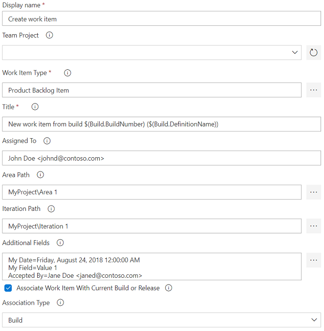
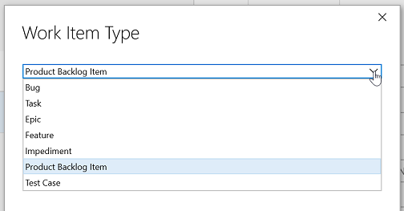
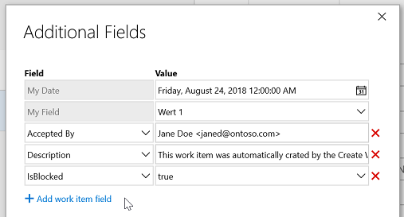
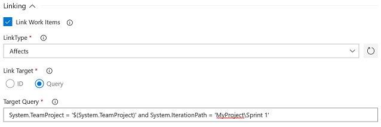
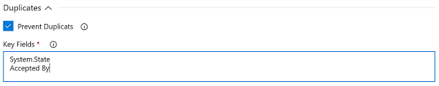
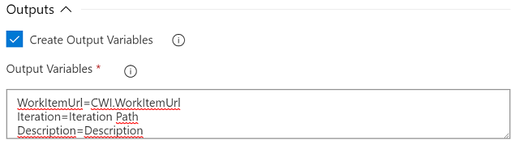

[Known Issues](#known-issues) | [Support](#support) | [YAML](#adding-the-task-to-a-yaml-definition) | [Task Parameters](#task-parameters) | [Linking](#linking) | [Attachments](#attachments) | [Duplicates](#duplicates) | [Outputs](#outputs) | [Advanced](#advanced) | [Bulk Mode](#bulk-mode)

# Create Work Item
The *Create Work Item* task allows you to create a work item from a build or release.

### Change Notes
You can find the changes notes for this task [here](https://github.com/MicrosoftPremier/VstsExtensions/blob/master/CreateWorkItem/en-US/changeNotes.md).

### Known Issues
- The dialogs for selecting work item type, area, iteration, as well as the dialog for setting up the field-value-mappings for additional fields only work in the classic pipeline UI. Due to technical restrictions they do **not** work in the task assistant view when editing YAML pipelines.
- Due to manifest changes in the Visual Studio Marketplace, the regular extension cannot be installed in an offline Team Foundation Server. If you need a working vsix file for your Team Foundation Server, please download the on-prem version of this extension from [here](https://github.com/MicrosoftPremier/VstsExtensions/tree/master/CreateWorkItem/on-prem).
- Due to an issue in extension handling of Team Foundation Server and Azure DevOps Services (and a complementary mistake in our extension manifests) you might get the message "Error finding the extension" when you try to open one of the custom task editors using the "three dots" buttons. If you run into this issue, please contact us via email so we can work with you to fix the problem.

### Support
If you need help with the extension, run into issues, or have feedback or ideas for new features, please contact us at <a href='&#109;&#97;&#105;&#108;&#116;&#111;&#58;&#112;&#115;&#103;&#101;&#114;&#101;&#120;&#116;&#115;&#117;&#112;&#112;&#111;&#114;&#116;&#64;&#109;&#105;&#99;&#114;&#111;&#115;&#111;&#102;&#116;&#46;&#99;&#111;&#109;'>&#112;&#115;&#103;&#101;&#114;&#101;&#120;&#116;&#115;&#117;&#112;&#112;&#111;&#114;&#116;&#64;&#109;&#105;&#99;&#114;&#111;&#115;&#111;&#102;&#116;&#46;&#99;&#111;&#109;</a> or create an issue [here](https://github.com/MicrosoftPremier/VstsExtensions/issues).

### Adding the Task to a YAML Definition
To add the *Create Work Item* task to a YAML build or release definition, use the task name and major version like this `- task: CreateWorkItem@1` and set a display name using the `displayName` property. Then add all task inputs as described under [Task Parameters](#task-parameters).

YAML snippet:

``` yaml
# Create or update a work item
- task: CreateWorkItem@2
  displayName: 'Create work item'
  inputs:
    #teamProject: # Optional
    workItemType: 
    title: 
    #assignedTo: # Optional
    #areaPath: # Optional
    #iterationPath: # Optional
    #fieldMappings: # Optional; Required if your process defines additional required work item fields
    #associate: false # Optional
    #associationType: build # Optional; Valid values: build, integratedInBuild, foundInBuild
    # ===== Linking Inputs =====
    #linkWorkItems: false # Optional
    #linkType: # Required if linkWorkItems = true
    #linkTarget: id # Optional; Valid values: id, wiql
    #targetId: # Required if linkWorkItems = true and linkTarget = id
    #targetWiql: # Required if linkWorkItems = true and linkTarget = wiql
    #limitWorkItemLinksToSameProject: false # Optional
    #linkPR: false # Optional
    #linkCode: false # Optional
    #commitsAndChangesets: # Required if linkCode = true
    # ===== Attachments Inputs =====
    #addAttachments: false # Optional
    #attachmentsFolder: # Optional
    #attachments: # Required if addAttachments = true
    # ===== Duplicate Inputs =====
    #preventDuplicates: false # Optional
    #keyFields: # Required if preventDuplicates = true
    #updateDuplicates: false # Optional
    #updateRules: # Optional
    # ===== Outputs Inputs =====
    #createOutputs: false # Optional
    #outputVariables: # Required if createOutputs = true
    # ===== Advanced Inputs =====
    #authType: internal # Optional; Valid values: internal, oidc, pat
    #targetOrg: # Optional; Only used if authType = pat or authType = oidc
    #authToken: # Required if authType = pat
    #serviceConnection: # Required if authType = oidc
    #allowRedirectDowngrade: false # Optional
    # ===== Bulk Mode =====
    #bulkMode: false # Optional
    #bulkConfigData: # Required if bulkMode = true
```

### Task Parameters
The task supports the default parameters listed below. All parameters support variables *including nested variables*.

**Security Note:** For security reasons we mask all secrets automatically. This ensures that you cannot exploit the *Create Work Item* task to gain access to secret values stored in Azure DevOps. Please be aware, though, that it usually isn't a good idea to try putting secrets in work item fields in the first place.



- <a name="teamProject">**Team Project:**</a> Select the team project in which to create the new work item or leave empty to use the current project. If the list is empty, click the refresh button on the right.

  **YAML: teamProject** - (Optional) Default is empty.

- <a name="workItemType">**Work Item Type:**</a> Specify the work item type you want to create. If you know the exact name of the work item type, simply type it into the textbox. You may also click on the selection icon on the right (three dots) and select a work item type from the drop-down list displayed in the opening dialog. This field is required.

  

  **YAML: workItemType** - (Required) Default is empty.

  **Note:** The dialog only shows work item types that you can create using the regular Azure DevOps UI. While technically possible, we do not recommend creating hidden work item types like code review work items.

- <a name="title">**Title:**</a> Enter the title for the new work item. This field is required.
  
  **YAML: title** - (Required) Default is empty.

- <a name="assignedTo">**Assigned To:**</a> Enter an optional identity to assign the new work item to. Since there currently is no way to use the regular identity picker control in build tasks or extensions, you have to manually enter the value in the correct format. Please make sure to use the format **Display Name &lt;Login Email Address&gt;** (e.g., *John Doe &lt;johnd@contoso.com&gt;*) or **Display Name &lt;Domain Account&gt;** (e.g., *John Doe &lt;contoso\\johnd&gt;*) for on-premises servers. If you want to dynamically assign the work item to the person requesting the build or release, you should use one of the RequestedForId variables (e.g., *$(Build.RequestedForId)* or *$(Release.Deployment.RequestedForId)*). Any incorrect format will creates an error and work item creation or update fails.
  
  **YAML: assignedTo** - (Optional) Default is empty.

- <a name="areaPath">**Area Path:**</a> Enter an optional area path for the new work item. If you omit this value, the work item will automatically be created in the default area path (i.e., the root area unless you created a special work item rule). Click the selection icon on the right (three dots) to select one of the existing areas.

  

  **YAML: areaPath** - (Optional) Default is empty. Use a backslash as the delimiter of area hierarchies (e.g., *'MyProject\Area1\Subarea1'*).

- <a name="iterationPath">**Iteration Path:**</a> Enter an optional iteration path for the new work item. If you omit this value, the work item will automatically be created in the default iteration path (i.e., the root iteration unless you created a special work item rule). By clicking the selection icon on the right (three dots) you can open a special iteration path picker that lets you choose between a specific iteration path (fixed value for all new work item) or a team name. If you select the team option, the new work item will always be created in the team's current iteration. In case there is no current iteration (e.g., no iterations have been associated with the team) the task falls back to the team's default iteration or the team's backlog iteration in that order depending on what value is available.

   

  **YAML: iterationPath** - (Optional) Default is empty. Use a backslash as the delimiter of iteration hierarchies (e.g., *'MyProject\Release1\Sprint1'*). If you want to assign the current area of a specific team, use the special value &lt;team name&gt;@currentIteration.

  **Note:** When you select a team's current iteration, the iteration path parameter has the special value *team name@currentIteration*. Do not change this value manually or the work item creation might fail.

- <a name="fieldMappings">**Additional Fields:**</a> If you want to set additional field values, specify them here. Each line in the text box should contain a field-value-mapping in the form of **Field Name=Field Value** (e.g., *Description=This is a test*). Please make sure to set valid values for all required fields in the selected work item type. If you use incorrect field values or field names, the task will fail to create the work item. Like the rest of the task inputs, the field mappings support variables and nested variables.

  We strongly recommend using the special editor for this field by clicking the selection button on the right (three dots). The editor ensures that you set values for all required fields, displays allowed values or special picker controls when necessary, and validates your inputs. Keep in mind, though, that there is no validation of inputs if you use variables instead of fixed values.

  

  If you need to set team-specific fields (i.e., Kanban column, Kanban swimlane, or Kanban column doing/done state), use the special syntax **&lt;Team Name&gt;:&lt;Board Type&gt;:&gt;Column|Lane|Column.Done&gt;=Value**. Examples for the three fields are:
  - *My Team:Backlog Items:Column=Approved*
  - *My Team:Backlog Items:Column.Done=true*
  - *My Team:Backlog Items:Lane=High Priority*

  **Note:** Team-specific fields are not supported by the special field mapping editor. You must add them manually!

  For long-text fields (e.g., Description, Acceptance Criteria), you can also mention identities, work items, or pull requests in the field value. To do so, you must use the following syntax:
  - **Identities:** `@<display name>`, `@<upn>` (for Azure DevOps Services only), or `@<domain\username>` (for Azure DevOps Server only).
  - **Work items:** `#id`
  - **Pull requests:** `!pr-id`

  **Examples:**
  - *Description=According to @&lt;contoso\\johnd&gt;, this is similar to #1234* - (this identity mention only works with Azure DevOps Server)
  - *Acceptance Criteria=Needs further details from @&lt;johnd@contoso.com&gt; Seems to add to the changes introduced by !42* - (this identity only works with Azure DevOps Services)
  - *History=@&lt;John Doe&gt;: please look into this*

  **YAML: fieldMappings** - (Optional) Default is empty. Start multiple entries with a pipe sign and keep each entry on a separate indented line. If the selected work item type has required fields other than title, make sure to include all of them in this list.

- <a name="associate">**Associate Work Item With Current Build or Release:**</a> Check this option if you want to associate the newly created work item with the current build or release environment.
  
  **YAML: associate** - (Optional) Default is *false*.

- <a name="associationType">**Association Type:**</a> Select the association type that should be used when linking work items to the current build or release. You can choose between `Build` (default), `Found in build`, or `Integrated in build`. Note that this parameter is only used for classic build or YAML pipelines; classic release always associates the work item with the `Integrated in release environment` type. This parameter is only visible if association to current build or release is enabled.
  
  **YAML: associationType** - (Optional) Default is *build*. Set to *build* for the `Build` option, *foundInBuild* for the `Found in build` option, and *integratedInBuild* for the `Integrated in build` option.

#### Linking
Use the parameters in the *Linking* group to control links from the newly created work item to already existing work items:



- <a name="linkWorkItems">**Link Work Items:**</a> Check this option to enable linking the new work item with one of more existing work items.
  
  **YAML: linkWorkItems** - (Optional) Default is *false*.

- <a name="linkType">**Link Type:**</a> Select the link type that should be used for linking other work items. If the drop-down list is empty, click the refresh button on the right. This option is only visible if linking is enabled.
  
  **YAML: linkType** - (Required) Default is empty. Set to the fully qualified link type name to use for linking (e.g., *System.LinkTypes.Hierarchy-Forward* for a *Child* link). Required if **linkWorkItems** is set to *true*.

  **Note:** The link type you select is used for the linked work item, not the created work item. Thus, if you select *Parent*, the linked work item will become the parent of the newly created work item. Please ensure that the combination of *Link Type* and *Link Target* results in a valid link relationship. E.g., if you select *Parent* as the link type and then use a *Target Query* that results in two or more work items, the task will fail to create the work item links since a work item can only have one parent.

- <a name="linkTarget">**Link Target:**</a> Choose `ID` and specify the *Target ID* to link the new work item to a specific work item with a known ID. Select `Query` and enter a valid *Target Query* to link the new work item to one ore more items matching a given work item query. Use the option `Associated Work Items` to link all work items that are associated with the current build or release to the new work item. This option is only visible if linking is enabled.
  
  **YAML: linkTarget** - (Optional) Default is *id*. Set to *id* if you want to link to a specific work item using its ID, *wiql* if you want to link to work items matching a WIQL query, or *associate* if you want to link to all work items that are associated to the current build/release.

- <a name="targetId">**Target ID:**</a> Enter the ID of the work item that should be linked to the new work item. This option is only visible if linking is enabled and *Link Target* is set to `ID`.
  
  **YAML: targetId** - (Required) Default is empty. Required if **linkTarget** is set to *id*.

- <a name="targetWiql">**Target Query:**</a> Enter a valid work item query ([WIQL syntax](https://docs.microsoft.com/en-us/vsts/boards/queries/wiql-syntax?view=vsts)) to select the linked work items. You may enter a full query or just the *WHERE* clause of the query as shown in the screenshot. The task will only use the *WHERE* clause and ignore any *SELECT*, *ORDER BY*, or *ASOF* clauses. This option is only visible if linking is enabled and *Link Target* is set to `Query`.
  
  **YAML: targetWiql** - (Required) Default is empty. Required if **linkTarget** is set to *wiql*.

- <a name="limitWorkItemLinksToSameProject">**Prevent Links to Other Projects:**</a> Check this option to prevent creating links to work items in a different project than the one the new work item was created in.

  **YAML: limitWorkItemLinksToSameProject** - (Optional) Default is *false*.

- <a name="linkPR">**Link to Pull Request:**</a> Check this option to enable linking the WorkItem with the Pull Request. This option will be ignored if it is not a Pull Request validation.
  
  **YAML: linkPR** - (Optional) Default is *false*.

- <a name="linkCode">**Link to Code:**</a> Enable this option to link the work item to specific commits or changesets.
  
  **YAML: linkCode** - (Optional) Default is *false*.

- <a name="commitsAndChangesets">**Commits and Changesets:**</a> List the commits and/or changesets to link to (one per line). Use the format *&lt;project name or ID&gt;:&lt;repository name or ID&gt;:&lt;commit hash&gt;* for commits or *CS&lt;changeset ID&gt;* for changesets. You must enter at least one commit or changeset if you enabled the option to link to code.
  
  **YAML: commitsAndChangesets** - (Required) Default is empty. Set to one or more commit and/or changeset IDs using the format described above. Start multiple entries with a pipe sign and keep each entry on a separate indented line. The use of variables is supported. Required if **linkCode** is set to *true*.

  **Example:**  
  ```yaml
  linkCode: true
  commitsAndChangesets: |
    $(System.TeamProjectId):$(Build.Repository.ID):$(Build.SourceVersion)
    myOtherProject:anotherRepo:ac2add7fae80bd4fe85f670243a40d79961b7ffb
    CS4711
  ```

#### Attachments
Use the parameters in the *Attachments* group to attach files to the new or updated work item.

**Security Note:** Please be careful not to attach any files that may contain sensitive data (e.g., memory dumps). If you really need those files, please ensure that you restrict access to the work item using area permissions in Azure DevOps.


- <a name="addAttachments">**Add Attachments:**</a> Check this option to to attach files to the new or updated work item. This may be useful if you, e.g.,  want to add build logs or other build artifacts to the work item for easier access.
  
  **YAML: addAttachments** - (Optional) Default is *false*.

- <a name="attachmentsFolder">**Source Folder:**</a> Root folder in which to search for attachments. If you leave this empty, the task looks for files in the default working directory (same as if you had specified `$(System.DefaultWorkingDirectory)`). This setting is only visible if the *Add Attachments* option is checked.
  
  **YAML: attachmentsFolder** - (Optional) Default is empty.

- <a name="attachments">**Source Folder:**</a> Files to attach to the work item. Supports multiple lines of match patterns. See [file matching patterns reference](https://docs.microsoft.com/en-us/azure/devops/pipelines/tasks/file-matching-patterns?view=azure-devops) for more information about supported patterns. This setting is visible and required if the *Add Attachments* option is checked.
  
  **YAML: attachments** - (Required) Default is empty. Set to one or more file matching patterns. Start multiple entries with a pipe sign and keep each entry on a separate indented line. Required if **addAttachments** is set to *true*

#### Duplicates
Use the parameters in the *Duplicates* group to control handling of duplicates that might be created by the task:



- <a name="preventDuplicates">**Prevent Duplicates:**</a> Check this option to prevent the task from creating duplicate work items. This may be useful if you, e.g.,  want to create a work item for the first failing build but not for subsequent failing builds. Make sure to specify *Key Fields* as well.
  
  **YAML: preventDuplicates** - (Optional) Default is *false*.

- <a name="keyFields">**Key Fields:**</a> List the fields (one per line) that should be used by the task to check whether the new work item would be a duplicate or not. You may use either the field names, field reference names, or a combination of both. To check for duplicates, the task constructs a work item query based on the key fields listed here and the values of those fields in the new work item. If the query returns one or more work items, they are considered duplicates of the new work item and the task does not create a new work item. This option is only visible if duplicate prevention is enabled.

  **Note:** Since long-text fields (e.g., *Description*, *Steps to Reproduce*, *History*) do not support the equals comparison operator, the task will use the *CONTAINS* operator instead. Thus, a key field definition for the field `Description` (without a rule) looks for all work items in which the description field contains the words from the new work item's description field.

  To allow flexibility in the search for duplicates, you can add rules to the key fields, which are used in the work item query. Rules take the form `{field name or reference name}{operator}{field value}` (e.g., `System.State!==Done`). The field value can either be a literal value, a pipeline variable, or a [WIQL macro](https://learn.microsoft.com/en-us/azure/devops/boards/queries/wiql-syntax?view=azure-devops#macros-or-variables) with the exception of the `[Any]` variable. If you want to check if a field is empty, use an empty string (i.e., `''` or `""`) as the value. Allowed operators are:
  - `===`, `!==` - checks if field is equal or not equal the given value
  - `<`, `<=`, `>`, `>=` - checks if the field value is lower than, lower than or equal, greater than, greater than or equal the given value
  - `==`, `!=` - checks if field value contains or does not contain the given value
  - `==[value, value, ...]`, `!=[value, value, ...]` - checks if field was is in or not in the list of given values

  **Note:** Not all fields support all operators. See [WIQL Operators](https://learn.microsoft.com/en-us/azure/devops/boards/queries/wiql-syntax?view=azure-devops#operators) for more information (even though the HTML field type that is used for most long-text fields like `System.Description` is not listed, it supports the same operators as *plaintext* fields)!
  
  **YAML: keyFields** - (Required) Default is empty. Start multiple entries with a pipe sign and keep each entry on a separate indented line. Required if **preventDuplicates** is set to *true*.

  **Example:** You configure the task to create a *Product Backlog Item* with title set to `Some Title` and area path set to `MyProject\Area1`, and you configure the key fields `Title`, `Area Path`, and `State`. The task would then create the following query:

  `SELECT System.Id FROM WorkItems WHERE System.Title = 'Some Title' AND System.AreaPath = 'MyProject\Area1' AND System.State = 'New'`

  System.State is checked for the value *New* because that is the initial value that would be used by the new work item.

  **Complex example:** You configure the task to create a *Product Backlog Item* with title set to `Some Title` and area path set to `MyProject\Area1`, and you configure the key fields `Title`, `Area Path`, and `State!==Done`. The task would then create the following query:

  `SELECT System.Id FROM WorkItems WHERE System.Title = 'Some Title' AND System.AreaPath = 'MyProject\Area1' AND System.State <> 'Done'`

- <a name="updateDuplicates">**Update Duplicate:**</a> Check this option to update a possible duplicate work item. If multiple duplicate work items are found, the task only updates the one that was last created (i.e., the item with the highest ID). To update work item fields specify one ore more *Update Rules*. The option ensures that work item links, build associations and pull request links are updates even if no *Update Rules* are specified. This option is only visible if duplicate prevention is enabled.

  **YAML: updateDuplicates** - (Optional) Default is *false*.

- <a name="updateRules">**Update Rules:**</a> Enter one ore more work item field update rules (one per line) to specify how the duplicate work item needs to be updated. Each rule has the format *&lt;Work Item Field (Reference) Name&gt;&lt;Update Operator&gt;&lt;Value&gt;*. You can use the field name or field reference name to specify the work item field. Within the value, you can reference pipeline variables in the regular format *$(Variable Name)* and work item field values in the format *${Work Item Field (Reference) Name}*. Possible update operators are:

  - Equals (**=**)  
    The equals operator simply overwrites the value of the specified work item field with the specified value. The rule *State=Done* would simply set the work item state to *Done*.
  - Plus-equals (**+=**)  
    The plus-equals operator only works for numeric fields and arithmetically adds the value to the current work item field value. The rule *BuildCount+=1* would increase the value in the field *BuildCount* by one.
  - Pipe-equals (**|=**)  
    The pipe-equals operator only works for text fields and concatenates the current work item field value with the new value. This is useful for multi-value fields like tags. The rule *Tags|=; Build $(Build.BuildNumber)* would add a new tag with the build number information. This is a convenient short form for using work item field references like this: *Tags=${System.Tags}; Build $(Build.BuildNumber)*

  **Note:** Field updates are applied in the order they in which they appear. Thus, if you need the original value of a work item field, make sure to reference it before updating it. Example: Use *System.History=Original title: ${System.Title}* first to store the original work item title in a comment before using *System.Title=New Title* to update the title.

  **YAML: updateRules** - (Required) Default is empty. Start multiple entries with a pipe sign and keep each entry on a separate indented line. Required if **updateDuplicates** is set to *true*.

#### Outputs
Use the parameter in the *Output Variables* group to control the creation of output variables that can be used by subsequent tasks:



- <a name="createOutputs">**Create Output Variables:**</a> Check this option to enable the creation of output variables. Variables are based on field values of the newly created work item and can be used in subsequent tasks within the same build/release phase. If duplicate handling is active and duplicates are found, the output variables are created based on the duplicate work item with the highest ID (i.e., the one that has been created last).
  
  **YAML: createOutputs** - (Optional) Default is *false*.

- <a name="outputVariables">**Output Variables:**</a> To allow maximum flexibility the task does not simply create a predefined set of output variables. Instead you can specify variable-value-mappings (one per line) in the form of **Variable Name=Work Item Value** (e.g., *NewDescription=Description*). This allows you to create just the variables you need for the values you need. You may use either the friendly field name (e.g., *Description*) or the reference name (e.g., *System.Description*) as the work item value. The following values can be used to reference special information of the work item:

  - **CWI.WorkItemUrl** - returns the URL that can be used to access the work item data as JSON (api URL)
  - **CWI.WorkItemEditUrl** - returns the URL that can be used to view and the work item in the browser

  You can reference the output variables like any other variable. If you used the mapping *NewDescription=Description*, you would reference your variable as *$(NewDescription)*.

  **YAML: outputVariables** - (Required) Default is empty. Start multiple entries with a pipe sign and keep each entry on a separate indented line. Required if **createOutputs** is set to *true*.

  **Note:** Make sure to name your output variables carefully when using multiple instances of the *Create Work Item* task in your build or release. If you use the same output variable in multiple tasks, each task overwrites the values from the previous task.

**Standard Output Variables**  
In addition to the custom defined output variables the task automatically creates the following output variables:

- **WorkItemLinkingSucceeded** - Set to `true` if work item linking was enabled and no errors occurred during linking. If there was an error (e.g., target work item not found), the variable is set to `false`. **Note:** The variable is not created at all if work item linking is not enabled.

- **WorkItemLinksFiltered** - Set to `true` if work item links have been filtered to the current project, `false` otherwise. **Note:** the variable is only generated if work item linking and the option 'Prevent Links to Other Projects' are enabled.

- **CodeLinkingSucceeded** - Set to `true` if code linking was enabled and no errors occurred during linking. If there was an error (e.g., target commit/changeset not found), the variable is set to `false`. **Note:** The variable is not created at all if code linking is not enabled.

#### Advanced
Use the parameter in the *Advanced* group to control special task features:

- <a name="authType">**Auth Type:**</a> By default (**Internal**), the task uses the pipeline's identity (a.k.a. build service account) to connect to Azure DevOps and create work items. In some cases, though, this might fail, because the identity does not have the necessary permissions to create work items. When you are running the task in a pull request build from a forked repository or limiting access of your pipelines to the pipeline's project but want to create work items in another project, you must provide a different way of authenticating to Azure DevOps. The task supports two additional authentication options: Personal Access Token (PAT) and workload identity federation (OIDC).

  When selecting **PAT**, you must provide a PAT in the **Auth Token** parameter. When selecting **OIDC**, you must provide a service connection of type Azure Resource Manager with workload identity federation in the **OIDC Connection** parameter.

  **Security Note:** Please be aware that allowing API access from pipelines that run for forked repositories can pose a security risk, especially if your pipeline is defined in YAML and you allow public forks! Use PAT and OIDC authentication with caution! In addition to configuring authentication here, you need to provide general access to secrets from pipelines that run for forks. See the official documentation about [repository protection](https://docs.microsoft.com/en-us/azure/devops/pipelines/security/repos?view=azure-devops) for more information.

  **YAML: authType** - (Required) Default is `internal`. Set to `pat` to use PAT authentication, set to `oidc` to use workload identity federation.

- <a name="targetOrg">**Target Organization:**</a> By default, the task always creates work items in the same organization in which the task is executed. When using PAT or OIDC authentication, though, it is also possible to create tasks in other organizations, as long as the PAT or OIDC identity has sufficient access to the organiztion. Leave this field empty to create work items in the current organization or provide the name or full URI of the another target organization. The value is only used if **Auth Type** is set to either **PAT** or **OIDC**.

**Note:** Organizations might still be using the old URI format `https://yourOrg.visualstudio.com` instead of the new format `https://dev.azure.com/yourOrg`. While cross-organization work item creation *should* work, regardless of the URI format used by source and target organization, we cannot guarantee that it does and will always work. If you encounter problems when trying to create work items in organizations with a different URI format, please provide the full target organization URI instead of just the name.

  **YAML: targetOrg** - (Optional) Default is empty.

- <a name="authToken">**Auth Token:**</a> Provide a Personal Access Token (PAT) to use for authentication to Azure DevOps. Please create a PAT with sufficient privileges (see below), store it in a secret variable (or another safe location from which you can retrieve it into a variable), and provide the variable here.

  **Note:** PATs are user-specific, expire after a certain amount of time, and require the creator of the PAT to regularly interact with Azure DevOps. Thus, PATs are not the most suitable authentication method for an automated process like creating work items from a pipeline. In addition, PATs cannot be scoped to specific projects or specific area paths within a project. They always have access to the projects/area paths the creator of the PAT has access to. Thus, the recommended way of authenticating - if using the pipeline identity does not work -  is workload identity federation (OIDC).

  **YAML: authToken** - (Required) Default is empty. Required if **authType** is set to `pat`.
  
  **Required Scopes:** We strongly encourage you to follow the *least privilege principle* when creating your PAT. For the task to properly work you only need the following security scopes:

  - Work Items: Read & Write (`vso.work_write`)

- <a name="oidcServiceConnection">**OIDC Connection:**</a> Select an Azure Resource Manager service connection that uses workload identity federation. The selected service connection is then used to connect to Azure DevOps. This is the recommended way of authenticating to Azure DevOps if your pipeline's identity does not have sufficient privileges to create work items in the target project.

  **Prerequisites**
  - Create an Azure Resource Manager service connection that uses workload identity federation (see [docs](https://learn.microsoft.com/en-us/azure/devops/pipelines/library/connect-to-azure?view=azure-devops#create-an-azure-resource-manager-service-connection-using-workload-identity-federation))
  - Add the service principal (or managed identity) that was created by the service connection to your Azure DevOps organizatoin (see [docs](https://learn.microsoft.com/en-us/azure/devops/integrate/get-started/authentication/service-principal-managed-identity?view=azure-devops#2-add-and-manage-service-principals-in-an-azure-devops-organization))
  - Set the necessary permissions for the service principal on your target projects (if possible, follow the principle of least privilege)

  **YAML: oidcServiceConnection** - (Required) Default is empty. Required if **authType** is set to `oidc`.

- <a name="allowRedirectDowngrade">**Allow Downgrade Redirects:**</a> Enable this option to allow redirects to downgrade from HTTPS to HTTP. Normally, you should never need to enable this option. However, for some on-premises setups where your Team Foundation or Azure DevOps Server is exposed through a gateway, which terminates the SSL connection, setting this option may be needed. If you are affected by such a setup, you will see the error message `Redirect from HTTPS to HTTP protocol. This downgrade is not allowed for security reasons. If you want to allow this behavior, set the allowRedirectDowngrade option to true.`.

  **Attention:** HTTPS to HTTP downgrades pose a security risk! Before enabling this option, please first consider changing your on-premises setup and enable HTTPS on your server instance instead of terminating the SSL connection on the gateway. To make the potential security risk visible, the task creates a warning if this option is enabled.

  **YAML: allowRedirectDowngrade** - (Optional) Default is `false`.

#### Bulk Mode
Bulk mode allows you to create multiple work items in one go. Since the primary use case of this task is to create or update a **single** work item, bulk mode requires JSON configuration and is not supported through the regular task parameters (see below).

**Important:** There is no feasible way to implement something like a transaction for this task. Thus, bulk mode executes each work item creation/update sequentially. If one of these actions fails, the task will fail even though work items may have been created/updated. Be mindful about possible side-effects this might create!

- <a name="bulkMode">**Bulk Mode:**</a> Enable this option to create/update multiple work items in one go. Bulk mode supports all features of the task (i.e., creation, duplicate handling, output variables, etc.) and works as if you added multiple Create Work Item tasks to your pipeline. Configuration must be presented in JSON format in the **Bulk Config Data** parameter (see below).

  **YAML: bulkMode** - (Optional) Default is `false`.

- <a name="bulkConfigData">**Bulk Config Data:**</a> Provide the configuration for each logical Create Work Item task as a JSON array. Each array element is a full Create Work Item task parameter object and supports and can contain all task parameters. The same rules for required parameters apply! Similar to the task itself, the parameter object only supports simple data types: string, boolean, numbers, and arrays for multi-line strings. The task does **not** run extensive validation on the object.

  **Important:** Even though the task supports OIDC authentication when creating/updating a single work item, bulk mode does not support OIDC! This is caused by a technical limitation of how Azure DevOps provides access to service connections to tasks. Therefore, bulk mode only support PAT authentication when accessing projects that cannot be accessed by the default pipeline identity.

  **Example bulk config data:**

  ```json
  [
    {
      "workItemType": "Issue",
      "title": "Issue from CWI task",
      "fieldMappings": [
        "Description=This has been bulk created by CWI task",
        "Priority=1"
      ]
      "associate": true
    },
    {
      "targetOrg": "SomeOrg",
      "teamProject": "SomeProject",
      "workItemType": "Product Backlog Item",
      "title": "PBI from CWI task",
      "fieldMappings": [
        "Description=This has been bulk created by CWI task",
        "Effort=13"
      ],
      "preventDuplicates": true,
      "keyFields": [
        "Description",
        "State!==Done"
      ],
      "updateRules": [
        "Effort+=1"
      ],
      "authType": "pat",
      "authToken": "pat goes here"
    }
  ]
  ```

  **YAML: bulkConfigData** - (Required) Default is empty. Required if **bulkMode** is set to `true`.

Icons made by [Pavel Kozlov](https://www.flaticon.com/authors/pavel-kozlov) from https://www.flaticon.com is licensed by [CC 3.0 BY](http://creativecommons.org/licenses/by/3.0/)
