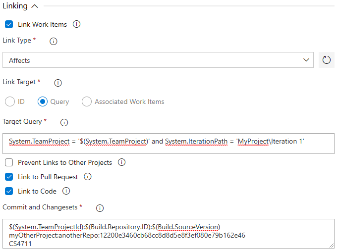

[Known Issues](#known-issues) | [Support](#support) | [Task Parameters](#task-parameters)

# Create Work Item
The *Create Work Item* task allows you to create a work item from a build or release.

### Change Notes
You can find the changes notes for this task [here](https://github.com/MicrosoftPremier/VstsExtensions/blob/master/CreateWorkItem/en-US/changeNotes.md).

### Known Issues
- Due to an issue in extension handling of Team Foundation Server and Azure DevOps Services (and a complementary mistake in our extension manifests) you might get the message "Error finding the extension" when you try to open one of the custom task editors using the "three dots" buttons. If you run into this issue, please contact us via email so we can work with you to fix the problem.

### Support
If you need help with the extension, run into issues, or have feedback or ideas for new features, please contact us at <a href='&#109;&#97;&#105;&#108;&#116;&#111;&#58;&#112;&#115;&#103;&#101;&#114;&#101;&#120;&#116;&#115;&#117;&#112;&#112;&#111;&#114;&#116;&#64;&#109;&#105;&#99;&#114;&#111;&#115;&#111;&#102;&#116;&#46;&#99;&#111;&#109;'>&#112;&#115;&#103;&#101;&#114;&#101;&#120;&#116;&#115;&#117;&#112;&#112;&#111;&#114;&#116;&#64;&#109;&#105;&#99;&#114;&#111;&#115;&#111;&#102;&#116;&#46;&#99;&#111;&#109;</a> or create an issue [here](https://github.com/MicrosoftPremier/VstsExtensions/issues).

### Task Parameters
The task supports the default parameters listed below. All parameters support variables *including nested variables*.

- <a name="workItemType">**Work Item Type:**</a> Specify the work item type you want to create. If you know the exact name of the work item type, simply type it into the textbox. You may also click on the selection icon on the right (three dots) and select a work item type from the drop-down list displayed in the opening dialog. This field is required.

  

  **Note:** The dialog only shows work item types that you can create using the regular Azure DevOps UI. While technically possible, we do not recommend creating hidden work item types like code review work items.

- <a name="title">**Title:**</a> Enter the title for the new work item. This field is required.

- <a name="assignedTo">**Assigned To:**</a> Optionally, enter an identity to assign the new work item to. Since there currently is no way to use the regular identity picker control in build tasks or extensions, you have to manually enter the value in the correct format. Please make sure to use the format **Display Name &lt;Login Email Address&gt;** (e.g., *John Doe &lt;johnd@contoso.com&gt;*). If you use an incorrect format, the task will fail to create the work item.

- <a name="areaPath">**Area Path:**</a> Enter an optional area path for the new work item. If you omit this value, the work item will automatically be created in the default area path (i.e., the root area unless you created a special work item rule). Click the selection icon on the right (three dots) to select one of the existing areas.

  

- <a name="iterationPath">**Iteration Path:**</a> Enter an optional iteration path for the new work item. If you omit this value, the work item will automatically be created in the default iteration path (i.e., the root iteration unless you created a special work item rule). Click the selection icon on the right (three dots) to select one of the existing iterations.

- <a name="fieldMappings">**Additional Fields:**</a> If you want to set additional field values, specify them here. Each line in the text box should contain a field-value-mapping in the form of **Field Name=Field Value** (e.g., *Description=This is a test*). Please make sure to set valid values for all required fields in the selected work item type. If you use incorrect field values or field names, the task will fail to create the work item. Like the rest of the task inputs, the field mappings support variables and nested variables.

  We strongly recommend using the special editor for this field by clicking the selection button on the right (three dots). The editor ensures that you set values for all required fields, displays allowed values or special picker controls when necessary, and validates your inputs. Keep in mind, though, that there is no validation of inputs if you use variables instead of fixed values.

  

- <a name="associate">**Associate Work Item With Current Build:**</a> Check this option if you want to associate the newly created work item with the current build. This option only takes effect when the task is running as part of a build; it is ignored when running inside a release.

#### Linking
Use the parameters in the *Linking* group to control links from the newly created work item to already existing work items:

- <a name="linkWorkItems">**Link Work Items:**</a> Check this option to enable linking the new work item with one of more existing work items.

- <a name="linkType">**Link Type:**</a> Select the link type that should be used for linking other work items. If the drop-down list is empty, click the refresh button on the right. This option is only visible if linking is enabled.

  **Note:** The link type you select is used for the linked work item, not the created work item. Thus, if you select *Parent*, the linked work item will become the parent of the newly created work item. Please ensure that the combination of *Link Type* and *Link Target* results in a valid link relationship. E.g., if you select *Parent* as the link type and then use a *Target Query* that results in two or more work items, the task will fail to create the work item links since a work item can only have one parent.

- <a name="linkTarget">**Link Target:**</a> Choose *ID* and specify the *Target ID* to link the new work item to a specific work item with a known ID. Select *Query* and enter a valid *Target Query* to link the new work item to one ore more items matching a given work item query. This option is only visible if linking is enabled.

- <a name="targetId">**Target ID:**</a> Enter the ID of the work item that should be linked to the new work item. This option is only visible if linking is enabled and *Link Target* is set to *ID*.

- <a name="targetWiql">**Target Query:**</a> Enter a valid work item query ([WIQL syntax](https://docs.microsoft.com/en-us/vsts/boards/queries/wiql-syntax?view=vsts)) to select the linked work items. You may enter a full query or just the *WHERE* clause of the query as shown in the screenshot. The task will only use the *WHERE* clause and ignore any *SELECT*, *ORDER BY*, or *ASOF* clauses.

#### Duplicates
Use the parameters in the *Duplicates* group to control handling of duplicates that might be created by the task:

- <a name="preventDuplicates">**Prevent Duplicates:**</a> Check this option to prevent the task from creating duplicate work items. This may be useful if you, e.g.,  want to create a work item for the first failing build but not for subsequent failing builds. Make sure to specify *Key Fields* as well.

- <a name="keyFields">**Key Fields:**</a> List the fields (one per line) that should be used by the task to check whether the new work item would be a duplicate or not. You may use either the field names, field reference names, or a combination of both. To check for duplicates, the task constructs a work item query based on the key fields listed here and the values of those fields in the new work item. If the query returns one or more work items, they are considered duplicates of the new work item and the task does not create a new work item.

  **Example:** You configure the task to create a *Product Backlog Item* with title set to "Some Title" and area path set to "MyProject\Area1", and you configure the key fields *Title*, *Area Path*, and *State*. The task would then create the following query:

  `SELECT System.Id FROM WorkItems WHERE System.Title = 'Some Title' AND System.AreaPath = 'MyProject\Area1' AND System.State = 'New'`

  System.State is checked for the value *New* because that is the initial value that would be used by the new work item.

Icons made by [Pavel Kozlov](https://www.flaticon.com/authors/pavel-kozlov) from https://www.flaticon.com is licensed by [CC 3.0 BY](http://creativecommons.org/licenses/by/3.0/)