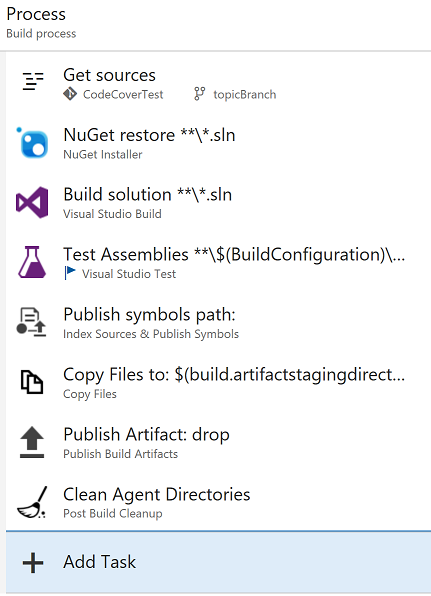
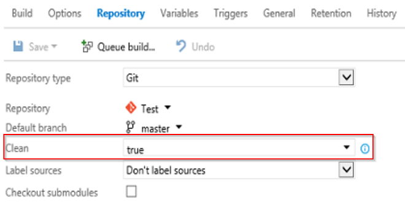
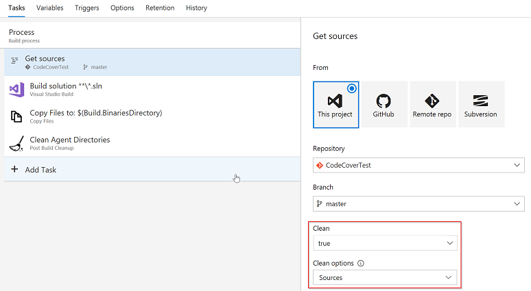

[Known Issues](#known-issues) | [Support](#support) | [Task Parameters](#task-parameters) | [Task Behavior](#behavior-of-the-task) | [TFS 2015 Support](#support-for-team-foundation-server-2015) | [FAQ](#faq)

# Post Build Cleanup
Did you ever run out of disk space on your build machine, because there were so many sources and binaries from previous build
runs? Then this extension is for you!

By default, the clean option of a build definition deletes files **before** the build starts. Thus, every build leaves behind
sources and binaries on your build machine, and those files accumulate and eat up your disk space. If you're not running
incremental builds, those files are not needed after the build has finished.

The *Post Build Cleanup* task deletes unwanted files from your build agent, **after** your build has run, thus, saving precious
disk space.

### Change Notes
You can find the changes notes for this task [here](https://github.com/almtcger/VstsExtensions/blob/master/PostBuildCleanup/en-US/changeNotes.md).

### Known Issues
- All current versions of the task do not work with build phases or YAML build definitions. Please see the [FAQ](https://github.com/almtcger/VstsExtensions/blob/master/PostBuildCleanup/en-US/FAQ.md) for more information.

### Support
If you need help with the extension or run into issues, please contact us at <a href='&#109;&#97;&#105;&#108;&#116;&#111;&#58;&#112;&#115;&#103;&#101;&#114;&#101;&#120;&#116;&#115;&#117;&#112;&#112;&#111;&#114;&#116;&#64;&#109;&#105;&#99;&#114;&#111;&#115;&#111;&#102;&#116;&#46;&#99;&#111;&#109;'>&#112;&#115;&#103;&#101;&#114;&#101;&#120;&#116;&#115;&#117;&#112;&#112;&#111;&#114;&#116;&#64;&#109;&#105;&#99;&#114;&#111;&#115;&#111;&#102;&#116;&#46;&#99;&#111;&#109;</a>.

### Adding the Task to a Build Definition
The *Post Build Cleanup* task (in task category *Utility*) must always be the last (enabled) task in your build definition!

### Task Parameters

#### Advanced
- <a name="noCertCheck">**Disable NodeJS certificate check:**</a> Check this option if your Team Foundation Server is using a self-signed or corporate SSL certificate and your
  build agent version is lower than 2.117.0. The option disables the certificate chain validation of NodeJS. Please read [here](https://github.com/almtcger/VstsExtensions/blob/master/PostBuildCleanup/en-US/NodeJSAndCertificates.md) for details.

### Behavior of the Task
The task behavior is directly linked to the clean options you select in your build definition's **Repository** settings. In the new build UI
the clean option has been moved to the **Get sources** task in the **Tasks** list.

 

If the **Clean** option is unchecked, the task does nothing. Otherwise, the task behavior depends on the selected value for **Clean options**
and mimics the pre-build cleanup behavior:

- **Sources:** If this option is selected, the task tries to clean the sources as described [here](https://www.visualstudio.com/en-us/docs/build/define/repository),
  which supports incremental gets of source files.

  **Note:** The task cannot scorch TFVC workspaces due to an authentication limitation. If you use TFVC, the task will always
  delete all contents of the $(Build.SourcesDirectory), thus, preventing incremental source gets!

- **Sources and output directory:** If this option is selected, the task deletes all contents of the $(Build.BinariesDirectory).

- **Sources directory:** If this option is selected, the task deletes all contents of the $(Build.SourcesDirectory).

  **Note:** If your build uses a Git repository, a minimal portion of the .git folder will remain on disk. Those remaining files
  are needed by the build agent's built-in *Post Job Cleanup*.

- **All build directories:** If this option is selected, the task deletes all contents within the $(Agent.BuildDirectory) and
  recreates the internal folder structure (i.e., the subfolders a, s, and b).

### Support for Team Foundation Server 2015
Team Foundation Server 2015 does not support the **Clean options** parameter. To configure the cleanup behavior, set the build
variable **Build.Clean** as described [here](https://www.visualstudio.com/en-us/docs/build/define/repository#build_clean_variable).
The values of **Build.Clean** are matched to the **Clean options** parameter as follows:

- *Not set* = *Sources*
- *binary* = *Sources and output directory*
- *source* = *Sources directory*
- *all* = *All build directories*

Because the build agent that comes with Team Foundation Server 2015 does contain a Git command line client, you must install
Git on the build machine, in order to support source cleanup. If Git is not installed, the task will fall back to delete
all contents of the $(Build.SourcesDirectory).

### FAQ
We have put together a list of frequently asked questions and answers in our [FAQ](https://github.com/almtcger/VstsExtensions/blob/master/PostBuildCleanup/en-US/FAQ.md) document.
If you feel we need to add a specific question to the list, feel free to send it to our [support](#support) address.

Icon made by [Freepik](http://www.freepik.com "Freepik") from [www.flaticon.com](http://www.flaticon.com "Flaticon") is
licensed by [CC 3.0 BY](http://creativecommons.org/licenses/by/3.0/ "Creative Commons BY 3.0")
