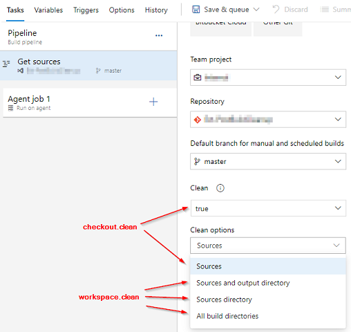

[Back to Overview](./overview.md)

# Guidance for Post Build Cleanup and YAML Pipelines
For some time now we have been receiving feedback about issues with *Post Build Cleanup* and YAML pipelines, and we have investigated how to fix these. However, the way pipeline tasks work prevents us from really fixing the problems. Thus, there will never be a version of *Post Build Cleanup* that fully supports YAML, and here is why (if you are not interested in the backgroun, go down to [Recommendations for YAML pipelines](#recommendations-for-yaml-pipelines)):

## Why the task is not working
*Post Build Cleanup* relies on two pieces of information:
- **The predefined variable *Build.Repository.Clean***  
  In classic pipelines, this variables is set to `true` when the *Clean* setting of the *Get sources* step is set to `true`.
- **The value of the build definition's `repository.properties.cleanOptions` setting**  
  The task reads the build definition using the Azure DevOps API and evaluates this property. The value depends on the setting *Clean options* of the *Get sources* step.

Since YAML supports working with multiple repositories (unlike classic), these options have been separated into the `clean` property of the `checkout` step, which cleans one specific repository folder on the agent, and the `clean` property of the `workspace` element of a job, which cleans the binaries directory (i.e., `$(Build.BinariesDirectory)`, e.g., `/agent/work/1/b`) when set to `outputs`, the sources directory (i.e., `$(Build.SourcesDirectory)`, e.g., `/agent/work/1/s`) when set to `resources`, or the pipeline workspace (i.e., `$(Pipeline.Workspace)`, e.g., `/agent/work/1`) when set to `all`.

When running a YAML pipeline, Azure DevOps only sets the values mentioned above as follows:

- Variable *Build.Repository.Clean* is only set if the `clean` parameter for the *self* repository is set to `true`. The `clean` parameter of all other repositories does not impact the variabale and is not visible to a pipeline task.
- The build definition returned by the API only contains the *self* repository. Any additional repository that is used by the pipeline is not listed in the definition JSON. The property `repository.properties.cleanOptions` is not affected at all by the `workspace.clean` setting of the job. It is only set if you specify *Clean* and *Clean options* through the UI for a YAML pipeline (i.e., open *Triggers* from the pipeline editor context menu, then got to the *YAML* tab, select *Get sources* and specify the settings they way you did for classic pipelines).

## What happens when the task runs in a YAML pipeline
Due to the aforementioned behavior of the variables and API responses, there can be multiple different behaviors of the *Post Build Cleanup* task:

- **Only one repository with default clone path**  
  When you only use one repository in your YAML pipeline and do not specify any special path to clone the repository to, *Post Build Cleanup* may work. With the latest update, we ensured that the task cleans the `$(Build.SourcesDirectory)` (e.g., `/agent/work/1/s`) when you set the `clean` property of the `checkout` step to `true`. In addition, you can specify other clean targets (e.g., the source and binaries folder) by going through the pipeline UI (see above).
- **Only one repository with custom clone path**  
  If you set the `path` property of the `checkout` task to something else then `$(Build.SourcesDirectory)`, *Post Build Cleanup* will fail. The task does not know about custom clone paths and cannot figure out where your repository was cloned. As a result, if you also set the `clean` property of the `checkout` step to `true`, the task will delete the `$(Build.SourcesDirectory)` (which will likely be empty anyway) but not the repository path.
- **Multiple repositories**  
  When using multiple repositories in you pipeline, *Post Build Cleanup* **might** work. As soon as you clone multiple repositories, the default behavior of Azure Pipelines is to clone them into `$(Build.SourcesDirectory)/{repository name}`. Since *Post Build Cleanup* does not know about multiple repositories, it tries to clean the `$(Build.SourcesDirectory)`, realizes that this is not a Git repository path, and deletes all contents of the folder. This automatically breaks incremental builds and leads to errors in the post-checkout jobs. You would have to clone the *self* repo to `$(Build.SourcesDirectory)` and put additional repositories outside of that folder in order to make *Post Build Cleanup* work partially.

## Recommendations for YAML pipelines
Our recommendation depends on the number of repositories and your personal liking:

### Only one repository in the pipeline
If you only need to clone one repository (the *self* repository) and you are willing to configure the cleanup behavior outside of your YAML file in the pipeline UI, you can continue using the *Post Build Cleanup* task in the newest version. To configure the cleanup behavior, edit your YAML pipeline in the browser, open the pipeline editor context menu (the three dots in the upper right corner), and select *Triggers*. Then click on the *YAML* tab, select the *Get sources* step on the left, set *Clean* to *true* and specify the required *Clean options*.

### All other cases
In all other cases where you need multiple repositories and/or only want to configure the pipeline through the YAML file itself, you must use a custom script to do the cleanup steps. We have put together a [steps template](./cleanupRepository.yml) that you can add at the end of your pipeline for every repository you want to clean. It executes the same logic that *Post Build Cleanup* executes.