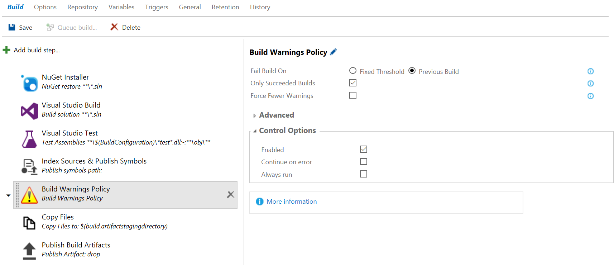

#Build Warnings Policy
Many software projects, especially older ones, that have grown over time end up with hundreds or thousands of build warnings.
Getting rid of these warnings through refactoring or cleaning up the code can be challenging, since new warnings get lost in
the existing ones. Choosing to treat warnings as errors if often not a feasible solution as this will force teams to bring the
warnings to zero or live with ever failing builds for a long time.

The *Build Warnings Policy* helps you keep track of your warning and reduce them over time. This is done by failing the build only,
if the number of warnings exceeds a specific value or increases between builds.

###Adding the Policy to a Build Definition
The *Build Warnings Policy* needs to be placed after the tasks it should inspect. In a Visual Studio build definition, e.g., an
appropriate place would be after build, test, and symbol indexing/publishing. This ensures that, even if the policy breaks the
build, you still get test results as well as the compile output and symbols.

###Parameters of the Build Warnings Policy
- **Fail Build On:** Set this option to `Fixed Threshold` to fail the build, if the number of warnings exceeds a specific value.
This is useful, if you want to allow a low number of warnings but keep them from getting out of hand. To bring down the number
of warnings over time, set this option to `Previous Build`. This will fail the build, if the number of warnings has increased
since the last build.

- **Warning Threshold:** Specify the number of warnings that must not be exceeded. This parameter is only visible, if *Fail Build On*
is set to `Fixed Threshold`.

- **Only Succeeded Builds:** Check this option, if you want to compare the current build to the last successful build. If you
uncheck this option, the policy will compare the current build to the last build regardless of its result. It is generally
recommended to keep this option checked, since comparing to failed builds can lead to growing numbers of warnings (e.g., build 1
succeeds with 10 warnings, build 2 fails with 15 warnings, build 3 succeeds with 15 warnings). This parameter is only visible, if
*Fail Build On* is set to `Previous Build`.

- **Force Fewer Warnings:** Check this option, if you want the current build to always have fewer warnings than the last one.

####Advanced
- **Task Filters:** Since the build system can run all kinds of tasks during the build process and any of these tasks can create
warnings, *Build Warnings Policy* needs to know, which tasks it should look at and which it has to ignore. *Task Filters* takes
a list of regular expressions (one per line). The policy will only look at build tasks that match one of the task filters. The
matching is done by looking at the timeline name of each task, which is displayed below the task name in the build definition. The
default value `/(build|ant|maven)/i` matches most of the standard build tasks in TFS/VSTS.
Click [here](http://developer.mozilla.org/en-US/docs/Web/JavaScript/Guide/Regular_Expressions) for more information about regular expressions. 